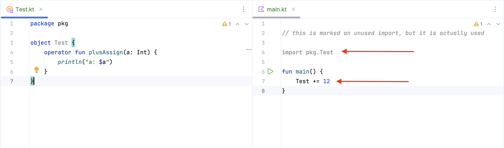

When an object has an operator function and a code from other project uses the operator function the import
of the object is marked as unused.

This results CVS commits with `remove unused imports` option active to actually break the code.

[Test.kt](/declaration/src/commonMain/kotlin/pkg/Test.kt)

```kotlin
package pkg

object Test {
    operator fun plusAssign(a: Int) {
        println("a: $a")
    }
}
```

[main.kt](/use/src/jvmMain/kotlin/main.kt)

```kotlin
import pkg.Test

fun main() {
    Test += 12
}
```

